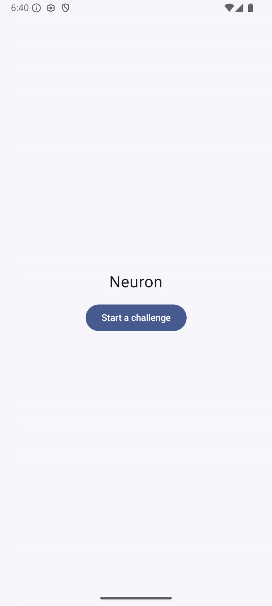

# Neuron app

## Context

The idea of this app is to build a cool app but also to put in practice a clean Android architecture including basic libraries, all of this in the best way possible.

## Product idea

Challenging the user on simple mental calculation.

## Demo

## Libraries used

- Jetpack navigation 3
- Koin 4